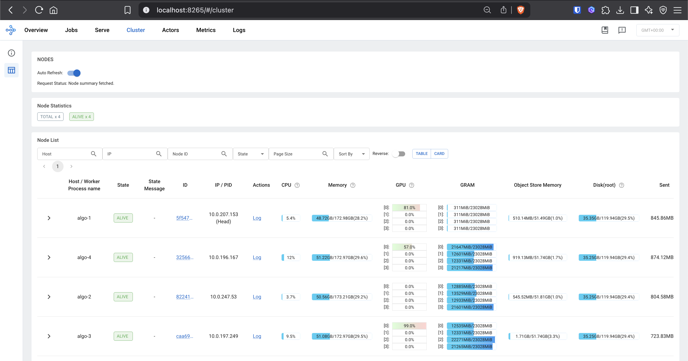
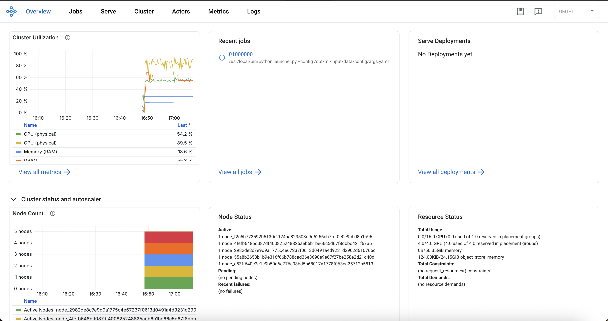

# Ray on Amazon SageMaker training jobs

This repository demonstrates how to use Ray for distributed data processing and model training within Amazon SageMaker training jobs.

## Table of Contents

- [Prerequisites](#prerequisites)
- [Project Structure](#project-structure)
- [Key Components](#key-components)
  - [Launcher](#launcher)
  - [Required Parameters and Environment Variables](#required-parameters-and-environment-variables)
    - [Parameter Reference](#parameter-reference)
    - [Environment Variables Reference](#environment-variables-reference)
  - [Script definition](#script-definition)
- [Example Usage](#example-usage)
- [Ray Dashboard](#ray-dashboard)
- [Ray Dashboard with Prometheus and Grafana integration](#ray-dashboard-with-prometheus-and-grafana-integration)
- [Ray Dashboard with local Prometheus and Grafana integration](#ray-dashboard-with-local-prometheus-and-grafana-integration)

## Prerequisites

- AWS account with Amazon SageMaker AI access
- Ray 2.0.0+

## Project Structure

```
ray-sagemaker-training/
├── scripts/
|    ├── launcher.py
|    └── requirements.txt
├── examples
```

## Key Components

### Launcher

The `launcher.py` script serves as the entry point for SageMaker training jobs and handles:

- Setting up the Ray environment for both single-node and multi-node scenarios
- Coordinating between head and worker nodes in a distributed setup
- Executing the appropriate script

#### ⚠️ Important Note

**The `launcher.py` script is not intended to be modified by users.** This script serves as a universal entrypoint for SageMaker training jobs and handles Ray cluster setup, coordination between nodes, and execution of your custom scripts.

You should:

- Write your own Ray scripts for data processing or model training
- Use `launcher.py` as the entrypoint in their SageMaker jobs
- Make sure your `requirements.txt` or your container includes `ray[data,train,tune,serve]` and `sagemaker`
- Specify the custom script path using the `--entrypoint` argument

### Required Parameters and Environment Variables

The `launcher.py` script requires specific parameters to execute your custom training scripts. You can configure these through command line arguments or environment variables.

### Parameter Reference

| Argument                | Type   | Required | Default          | Description                                                              |
| ----------------------- | ------ | -------- | ---------------- | ------------------------------------------------------------------------ |
| `--entrypoint`          | string | No\*     | None             | Path to your script (e.g., `training/train.py`)                          |
| `--head-instance-group` | string | Yes\*\*  | None             | Instance group name for Ray head node (heterogeneous clusters only)      |
| `--head-num-cpus`       | int    | No       | Instance default | Number of CPUs reserved for head node                                    |
| `--head-num-gpus`       | int    | No       | Instance default | Number of GPUs reserved for head node                                    |
| `--include-dashboard`   | bool   | No       | True             | Enable Ray dashboard                                                     |
| `--launch-prometheus`   | bool   | No       | False            | Launch local Prometheus on the head node. Internet connectivity required |
| `--wait-shutdown`       | int    | No       | None             | Seconds to wait before Ray shutdown                                      |

\*Required if `entry_script` environment variable is not set  
\*\*Required only for heterogeneous clusters

### Environment Variables Reference

| Variable              | Type   | Required | Description                                                                                 |
| --------------------- | ------ | -------- | ------------------------------------------------------------------------------------------- |
| `head_instance_group` | string | No       | Alternative way to set head instance group name (heterogeneous clusters only)               |
| `head_num_cpus`       | int    | No       | Alternative way to set number of CPUs reserved for head node                                |
| `head_num_gpus`       | int    | No       | Alternative way to set number of GPUs reserved for head node                                |
| `launch_prometheus`   | bool   | No       | Alternative way to launch local Prometheus on the head node. Internet connectivity required |
| `wait_shutdown`       | int    | No       | Alternative way to set shutdown wait time                                                   |

\*Required if `--entrypoint` argument is not provided

### Script definition

The Python file to execute must contain the block

```python
if __name__ == "__main__":
    code
```

Example:

```python
import ray

<YOUR_RAY_CODE>

if __name__ == "__main__":
    pass
```

## Example Usage

The launcher script has been designed to be flexible and dynamic, allowing you to specify any entry script through arguments or environment variables, rather than hardcoded imports.

### Option 1: Entrypoint Argument

The launcher uses one argument:

- `--entrypoint`: Path to the script to execute (must contain `if __name__ == "__main__":` block)

### Option 2: Environment Variables (compatibility with SageMaker Python SDK Estimator)

The launcher uses two key environment variables:

- `source_dir`: The directory containing your entry script, under Estimator `source_dir`
- `entry_script`: The Python file to execute (must contain `if __name__ == "__main__":` block)

### Usage Examples

See the content of [examples](./examples)

#### 1. Using SageMaker ModelTrainer (Recommended)

```python
from sagemaker.modules.configs import (
    Compute,
    OutputDataConfig,
    SourceCode,
    StoppingCondition,
    InputData,
)
from sagemaker.modules.train import ModelTrainer

args = [
    "--epochs",
    "25",
    "--learning_rate",
    "0.001",
    "batch_size",
    "100",
]

# Define the source code configuration
source_code = SourceCode(
    source_dir="./scripts",
    requirements="requirements.txt",
    command=f"python launcher.py -e training/train.py {' '.join(args)}",
)

# Define compute configuration
compute_configs = Compute(
    instance_type="ml.g4dn.xlarge",
    instance_count=1,
    keep_alive_period_in_seconds=0,
)

# Define training job name and output path
job_name = "train-ray-training"
output_path = f"s3://{bucket_name}/{job_name}"

# Create the ModelTrainer
model_trainer = ModelTrainer(
    training_image=image_uri,
    source_code=source_code,
    base_job_name=job_name,
    compute=compute_configs,
    stopping_condition=StoppingCondition(max_runtime_in_seconds=18000),
    output_data_config=OutputDataConfig(s3_output_path=output_path),
)

...

# Start the training job
model_trainer.train(input_data_config=[train_input, test_input], wait=False)
```

#### 2. Using SageMaker ModelTrainer (with environment variables)

```python
from sagemaker.modules.configs import (
    Compute,
    OutputDataConfig,
    SourceCode,
    StoppingCondition,
    InputData,
)
from sagemaker.modules.train import ModelTrainer

# Define the source code configuration
source_code = SourceCode(
    source_dir="./scripts",
    requirements="requirements.txt",
    entry_script="launcher.py",
)

# Define compute configuration
compute_configs = Compute(
    instance_type="ml.g4dn.xlarge",
    instance_count=1,
    keep_alive_period_in_seconds=0,
)

# Define training job name and output path
job_name = "train-ray-training"
output_path = f"s3://{bucket_name}/{job_name}"

# Create the ModelTrainer
model_trainer = ModelTrainer(
    training_image=image_uri,
    source_code=source_code,
    base_job_name=job_name,
    compute=compute_configs,
    environment={
        "entrypoint": "training/train.py",           # Look in training/ subdirectory containing your entry script, under SourceCode `source_dir`
    },
    hyperparameters={
        "epochs": 25,
        "learning_rate": 0.001,
        "batch_size": 100,
    },
    stopping_condition=StoppingCondition(max_runtime_in_seconds=18000),
    output_data_config=OutputDataConfig(s3_output_path=output_path),
)

...

# Start the training job
model_trainer.train(input_data_config=[train_input, test_input], wait=False)
```

#### 3. Using PyTorch Estimator

```python
from sagemaker.pytorch import PyTorch

# Configure your training job
estimator = PyTorch(
    entry_point="launcher.py",
    source_dir="scripts",
    role=role,
    instance_type="ml.g4dn.xlarge",
    instance_count=1,
    framework_version="2.6.0",
    py_version="py312",
    hyperparameters={
        "entrypoint": "training/train.py", # Define the entrypoint HERE
        "epochs": 25,
        "learning_rate": 0.001,
        "batch_size": 100,
    }
)

estimator.fit({"training": training_data_path})
```

#### 4. Heterogeneous Cluster training with PyTorch Estimator

For heterogeneous clusters with different instance types, you can use instance groups to optimize resource allocation. This is particularly useful when you want to separate coordination (head node) from computation (worker nodes).

```python
from sagemaker.pytorch import PyTorch
from sagemaker.instance_group import InstanceGroup
from sagemaker.inputs import TrainingInput

# Define instance groups with different instance types
instance_groups = [
    InstanceGroup(
        instance_group_name="head-instance-group",
        instance_type="ml.t3.xlarge",  # CPU-only for coordination
        instance_count=1
    ),
    InstanceGroup(
        instance_group_name="worker-instance-group",
        instance_type="ml.g5.xlarge",  # GPU instances for training
        instance_count=2
    )
]

# Configure the estimator for heterogeneous training
estimator = PyTorch(
    source_dir="./scripts",
    entry_point="launcher.py",
    output_path=output_path,
    base_job_name=job_name,
    role=role,
    instance_groups=instance_groups,  # Use instance groups instead of instance_type/count
    max_run=432000,
    image_uri=image_uri,
    environment={
        "head_instance_group": "head-instance-group",  # Specify which group is the head
        "head_num_cpus": "0",  # Head node as coordinator only (0 CPUs for computation)
        "head_num_gpus": "0",  # Head node as coordinator only (0 GPUs for computation)
    },
    hyperparameters={
        "entrypoint": "training/train.py",
        "epochs": 25,
        "learning_rate": 0.001,
        "batch_size": 100,
    },
)

# Configure data inputs for heterogeneous clusters
train_input = TrainingInput(
    s3_data_type='S3Prefix',
    s3_data=train_dataset_s3_path,
    distribution='FullyReplicated',
    instance_groups=["head-instance-group", "worker-instance-group"],  # Data available to both groups
)

test_input = TrainingInput(
    s3_data_type='S3Prefix',
    s3_data=test_dataset_s3_path,
    distribution='FullyReplicated',
    instance_groups=["head-instance-group", "worker-instance-group"],  # Data available to both groups
)

# Start training
estimator.fit({"train": train_input, "test": test_input})
```

**Key Environment variables for Heterogeneous Clusters:**

- `--head_instance_group`: Specifies which instance group should act as the Ray head node
- `--head_num_cpus`: Number of CPUs to reserve for the head node (set to 0 for coordinator-only mode)
- `--head_num_gpus`: Number of GPUs to reserve for the head node (set to 0 for coordinator-only mode)

### Entry Script Requirements

Your entry scripts must follow this pattern:

```python
# my_script.py
...
<MY CODE HERE>
...

if __name__ == "__main__":
    # This block will be executed by the launcher
    <MY CODE HERE>
```

## Ray Dashboard

For accessing the Ray Dashboard during the execution of Ray workload, we can leverage the native feature to access [SageMaker training jobs by using AWS System Manager (SSM)](https://docs.aws.amazon.com/sagemaker/latest/dg/train-remote-debugging.html)

### Step 1: Setup IAM Permissions:

Please refer to the official [AWS Documentation](https://docs.aws.amazon.com/sagemaker/latest/dg/train-remote-debugging.html#train-remote-debugging-iam)

### Step 2:

Enable remote debugging for SageMaker training jobs:

#### Option 1: ModelTrainer class

```python
from sagemaker.modules.configs import (
    CheckpointConfig,
    Compute,
    OutputDataConfig,
    RemoteDebugConfig,
    SourceCode,
    StoppingCondition,
)
from sagemaker.modules.train import ModelTrainer

# Define the script to be run
source_code = SourceCode(
    source_dir="./scripts",
    requirements="requirements.txt",
    command="python launcher.py --entrypoint training/train_ray.py",
)

# Define the compute
compute_configs = Compute(
    instance_type=instance_type,
    instance_count=instance_count,
    keep_alive_period_in_seconds=0,
)

...

# Define the ModelTrainer
model_trainer = ModelTrainer(
    training_image=image_uri,
    source_code=source_code,
    base_job_name=job_name,
    compute=compute_configs,
    stopping_condition=StoppingCondition(max_runtime_in_seconds=18000),
    environment={
        "RAY_gcs_server_request_timeout_seconds": "120",
    },
    hyperparameters={
        "config": "/opt/ml/input/data/config/args.yaml"  # path to TRL config which was uploaded to s3
    },
    output_data_config=OutputDataConfig(s3_output_path=output_path),
    checkpoint_config=CheckpointConfig(
        s3_uri=output_path + "/checkpoint", local_path="/opt/ml/checkpoints"
    ),
    role=role,
).with_remote_debug_config(RemoteDebugConfig(enable_remote_debug=True))
```

#### Option 2: PyTorch Estimator

```python
from sagemaker.pytorch import PyTorch

# define training job Name
job_name = "inference-resnet-ray"

# define OutputDataConfig path
if default_prefix:
    output_path = f"s3://{bucket_name}/{default_prefix}/{job_name}"
else:
    output_path = f"s3://{bucket_name}/{job_name}"

estimator = PyTorch(
    source_dir="./scripts",
    entry_point="launcher.py",
    output_path=output_path,
    base_job_name=job_name,
    role=role,
    instance_type=instance_type,
    instance_count=instance_count,
    encrypt_inter_container_traffic=False,
    enable_network_isolation=False,
    max_run=432000,
    image_uri=image_uri,
    environment={
        "RAY_gcs_server_request_timeout_seconds": "120",
        "RAY_DATA_AUTOLOAD_PYEXTENSIONTYPE": "1",
    },
    hyperparameters={
        "entrypoint": "train.py",
    },
    enable_remote_debug=True,
)
```

### Step 3:

Access the training container, by starting a Port Forwarding to the port `8265` (Default Ray Dashboard port) with the following command:

```
aws ssm start-session --target sagemaker-training-job:<training-job-name>_algo-<n> \
--region <aws_region> \
--document-name AWS-StartPortForwardingSession \
--parameters '{"portNumber":["8265"],"localPortNumber":["8265"]}’
```

In a multi-node cluster, you can check the head node by investigating the CloudWatch logs:

```
2025-06-25 08:47:18,755 - __main__ - INFO - Found multiple hosts, initializing Ray as a multi-node cluster
2025-06-25 08:47:18,755 - __main__ - INFO - Head node: algo-1, Current host: algo-3
```

### Step 4:

Access the Ray Dashboard from your browser: `localhost:8265`:



## Ray Dashboard with Prometheus and Grafana integration

For accessing the Ray Dashboard with Prometheus running on the SageMaker cluster and Grafana integration, during the execution of Ray workload, we can leverage the native feature to access [SageMaker training jobs by using AWS System Manager (SSM)](https://docs.aws.amazon.com/sagemaker/latest/dg/train-remote-debugging.html)

### Step 1: Setup IAM Permissions:

Please refer to the official [AWS Documentation](https://docs.aws.amazon.com/sagemaker/latest/dg/train-remote-debugging.html#train-remote-debugging-iam)

### Step 2:

Enable remote debugging for SageMaker training jobs:

#### Option 1: ModelTrainer class

```python
from sagemaker.modules.configs import (
    CheckpointConfig,
    Compute,
    OutputDataConfig,
    RemoteDebugConfig,
    SourceCode,
    StoppingCondition,
)
from sagemaker.modules.train import ModelTrainer

# Define the script to be run
source_code = SourceCode(
    source_dir="./scripts",
    requirements="requirements.txt",
    command="python launcher.py --entrypoint train_ray.py",
)

# Define the compute
compute_configs = Compute(
    instance_type=instance_type,
    instance_count=instance_count,
    keep_alive_period_in_seconds=0,
)

...

# Define the ModelTrainer
model_trainer = ModelTrainer(
    training_image=image_uri,
    source_code=source_code,
    base_job_name=job_name,
    compute=compute_configs,
    stopping_condition=StoppingCondition(max_runtime_in_seconds=18000),
    environment={
        "RAY_GRAFANA_HOST": "<GRAFANA_HOST>",
        "RAY_PROMETHEUS_HOST": "<PROMETHEUS_HOST>",
        "RAY_PROMETHEUS_NAME": "prometheus",
    },
    hyperparameters={
        "config": "/opt/ml/input/data/config/args.yaml"  # path to TRL config which was uploaded to s3
    },
    output_data_config=OutputDataConfig(s3_output_path=output_path),
    checkpoint_config=CheckpointConfig(
        s3_uri=output_path + "/checkpoint", local_path="/opt/ml/checkpoints"
    ),
    role=role,
).with_remote_debug_config(RemoteDebugConfig(enable_remote_debug=True))
```

#### Option 2: PyTorch Estimator

```python
from sagemaker.pytorch import PyTorch

# define training job Name
job_name = "inference-resnet-ray"

# define OutputDataConfig path
if default_prefix:
    output_path = f"s3://{bucket_name}/{default_prefix}/{job_name}"
else:
    output_path = f"s3://{bucket_name}/{job_name}"

estimator = PyTorch(
    source_dir="./scripts",
    entry_point="launcher.py",
    output_path=output_path,
    base_job_name=job_name,
    role=role,
    instance_type=instance_type,
    instance_count=instance_count,
    encrypt_inter_container_traffic=False,
    enable_network_isolation=False,
    max_run=432000,
    image_uri=image_uri,
    environment={
        "RAY_GRAFANA_HOST": "<GRAFANA_HOST>",
        "RAY_PROMETHEUS_HOST": "<PROMETHEUS_HOST>",
        "RAY_PROMETHEUS_NAME": "prometheus",
    },
    hyperparameters={
        "entrypoint": "train.py",
    },
    enable_remote_debug=True,
)
```

### Step 3 - Port Forwarding to the Prometheus port in the Grafana server environment:

To make sure your Grafana server will collect the captured metrics by Prometheus, we have to access the training container, by starting a Port Forwarding to the port `8080` (Default port where Ray exports metrics) with the following command:

```
aws ssm start-session --target sagemaker-training-job:<training-job-name>_algo-<n> \
--region <aws_region> \
--document-name AWS-StartPortForwardingSession \
--parameters '{"portNumber":["8080"],"localPortNumber":["<YOUR_LOCAL_PORT>"]}’
```

In a multi-node cluster, you can check the head node by investigating the CloudWatch logs:

```
2025-06-25 08:47:18,755 - __main__ - INFO - Found multiple hosts, initializing Ray as a multi-node cluster
2025-06-25 08:47:18,755 - __main__ - INFO - Head node: algo-1, Current host: algo-3
```

### Step 4 - Configure prometheus.yml to scrape metrics on the local port:

Configure your `prometheus.yml` file to scrape metrics on the local port where you are forwarding the Ray metrics:

```
...
scrape_configs:
  - job_name: 'ray'
    static_configs:
      - targets: ['localhost:<YOUR_LOCAL_PORT>']
    metrics_path: '/metrics'
  ...
```

### Step 5 - Port Forwarding to the Ray Dashboard port:

Access the training container, by starting a Port Forwarding to the port `8265` (Default Ray Dashboard port) with the following command:

```
aws ssm start-session --target sagemaker-training-job:<training-job-name>_algo-<n> \
--region <aws_region> \
--document-name AWS-StartPortForwardingSession \
--parameters '{"portNumber":["8265"],"localPortNumber":["8265"]}’
```

In a multi-node cluster, you can check the head node by investigating the CloudWatch logs:

```
2025-06-25 08:47:18,755 - __main__ - INFO - Found multiple hosts, initializing Ray as a multi-node cluster
2025-06-25 08:47:18,755 - __main__ - INFO - Head node: algo-1, Current host: algo-3
```

### Step 6:

Access the Ray Dashboard from your browser: `localhost:8265`:



## Ray Dashboard with local Prometheus and Grafana integration

For accessing the Ray Dashboard with local Prometheus running on the SageMaker cluster and Grafana integration, during the execution of Ray workload, we can leverage the native feature to access [SageMaker training jobs by using AWS System Manager (SSM)](https://docs.aws.amazon.com/sagemaker/latest/dg/train-remote-debugging.html)

### Step 1: Setup IAM Permissions:

Please refer to the official [AWS Documentation](https://docs.aws.amazon.com/sagemaker/latest/dg/train-remote-debugging.html#train-remote-debugging-iam)

### Step 2:

Enable remote debugging for SageMaker training jobs:

#### Option 1: ModelTrainer class

```python
from sagemaker.modules.configs import (
    CheckpointConfig,
    Compute,
    OutputDataConfig,
    RemoteDebugConfig,
    SourceCode,
    StoppingCondition,
)
from sagemaker.modules.train import ModelTrainer

# Define the script to be run
source_code = SourceCode(
    source_dir="./scripts",
    requirements="requirements.txt",
    command="python launcher.py --entrypoint train_ray.py",
)

# Define the compute
compute_configs = Compute(
    instance_type=instance_type,
    instance_count=instance_count,
    keep_alive_period_in_seconds=0,
)

...

# Define the ModelTrainer
model_trainer = ModelTrainer(
    training_image=image_uri,
    source_code=source_code,
    base_job_name=job_name,
    compute=compute_configs,
    stopping_condition=StoppingCondition(max_runtime_in_seconds=18000),
    environment={
        "launch_prometheus": "true",
        "RAY_GRAFANA_HOST": "<GRAFANA_HOST>",
        "RAY_PROMETHEUS_HOST": "<PROMETHEUS_HOST>"
        "RAY_PROMETHEUS_NAME": "prometheus",
    },
    hyperparameters={
        "config": "/opt/ml/input/data/config/args.yaml"  # path to TRL config which was uploaded to s3
    },
    output_data_config=OutputDataConfig(s3_output_path=output_path),
    checkpoint_config=CheckpointConfig(
        s3_uri=output_path + "/checkpoint", local_path="/opt/ml/checkpoints"
    ),
    role=role,
).with_remote_debug_config(RemoteDebugConfig(enable_remote_debug=True))
```

#### Option 2: PyTorch Estimator

```python
from sagemaker.pytorch import PyTorch

# define training job name:
job_name = "inference-resnet-ray"

# define OutputDataConfig path
if default_prefix:
    output_path = f"s3://{bucket_name}/{default_prefix}/{job_name}"
else:
    output_path = f"s3://{bucket_name}/{job_name}"

estimator = PyTorch(
    source_dir="./scripts",
    entry_point="launcher.py",
    output_path=output_path,
    base_job_name=job_name,
    role=role,
    instance_type=instance_type,
    instance_count=instance_count,
    encrypt_inter_container_traffic=False,
    enable_network_isolation=False,
    max_run=432000,
    image_uri=image_uri,
    environment={
        "launch_prometheus": "true",
        "RAY_GRAFANA_HOST": "<GRAFANA_HOST>",
        "RAY_PROMETHEUS_NAME": "prometheus",
    },
    hyperparameters={
        "entrypoint": "train.py",
    },
    enable_remote_debug=True,
)
```

### Step 3 - Port Forwarding to the Prometheus port in the Grafana server environment:

To make sure your Grafana server will collect the captured metrics by Prometheus, we have to access the training container, by starting a Port Forwarding to the port `9090` (Default Prometheus port) with the following command:

```
aws ssm start-session --target sagemaker-training-job:<training-job-name>_algo-<n> \
--region <aws_region> \
--document-name AWS-StartPortForwardingSession \
--parameters '{"portNumber":["9090"],"localPortNumber":["9090"]}’
```

In a multi-node cluster, you can check the head node by investigating the CloudWatch logs:

```
2025-06-25 08:47:18,755 - __main__ - INFO - Found multiple hosts, initializing Ray as a multi-node cluster
2025-06-25 08:47:18,755 - __main__ - INFO - Head node: algo-1, Current host: algo-3
```

### Step 4 - Port Forwarding to the Ray Dashboard port:

Access the training container, by starting a Port Forwarding to the port `8265` (Default Ray Dashboard port) with the following command:

```
aws ssm start-session --target sagemaker-training-job:<training-job-name>_algo-<n> \
--region <aws_region> \
--document-name AWS-StartPortForwardingSession \
--parameters '{"portNumber":["8265"],"localPortNumber":["8265"]}’
```

In a multi-node cluster, you can check the head node by investigating the CloudWatch logs:

```
2025-06-25 08:47:18,755 - __main__ - INFO - Found multiple hosts, initializing Ray as a multi-node cluster
2025-06-25 08:47:18,755 - __main__ - INFO - Head node: algo-1, Current host: algo-3
```

### Step 5:

Access the Ray Dashboard from your browser: `localhost:8265`:


### (Optional) Provide prometheus binary file

By default, Ray downloads the Prometheus binary from the internet when launching Prometheus for metrics collection. In environments with limited internet connectivity or for better control over dependencies, you can pre-download the Prometheus binary, upload it to S3, and provide it as a training parameter.

#### Step 1: Download Prometheus Binary

Download the appropriate Prometheus binary for your target environment (typically Linux AMD64 for SageMaker training instances):

```bash
wget https://github.com/prometheus/prometheus/releases/download/v3.4.2/prometheus-3.4.2.linux-amd64.tar.gz
```

#### Step 2: Upload to S3

Upload the downloaded binary to your S3 bucket:

```python
import boto3
import sagemaker

sagemaker_session = sagemaker.Session()
s3_client = boto3.client('s3')

bucket_name = sagemaker_session.default_bucket()
default_prefix = sagemaker_session.default_bucket_prefix

# Define S3 path for prometheus binary
if default_prefix:
    input_path = f"{default_prefix}/datasets/your-project-name"
else:
    input_path = f"datasets/your-project-name"

prometheus_s3_path = f"s3://{bucket_name}/{input_path}/prometheus/prometheus-3.4.2.linux-amd64.tar.gz"

# Upload the binary to S3
s3_client.upload_file(
    "./prometheus-3.4.2.linux-amd64.tar.gz",
    bucket_name,
    f"{input_path}/prometheus/prometheus-3.4.2.linux-amd64.tar.gz",
)

print(f"Prometheus binary uploaded to: {prometheus_s3_path}")
```

#### Step 3: Configure Training Input

Add the Prometheus binary as a training input channel:

```python
from sagemaker.inputs import TrainingInput

prometheus_input = TrainingInput(
    s3_data_type="S3Prefix",
    s3_data=prometheus_s3_path,
    distribution="FullyReplicated",
    instance_groups=["head-instance-group", "worker-instance-group"],  # For heterogeneous clusters
)

# Add to your training data inputs
data = {
    "train": train_input,
    "test": test_input,
    "config": config_input,
    "prometheus": prometheus_input,  # Add prometheus input
}
```

#### Step 4: Configure Environment Variables and Hyperparameters

Configure your estimator to use the provided Prometheus binary with the required environment variables:

```python
estimator = PyTorch(
    source_dir="./scripts",
    entry_point="launcher.py",
    # ... other configuration ...
    environment={
        "head_instance_group": "head-instance-group",
        "head_num_cpus": "0",
        "head_num_gpus": "0",
        "launch_prometheus": "true",  # Enable Prometheus launch
        "RAY_GRAFANA_HOST": "<GRAFANA_HOST>",  # Replace with your Grafana host
        "RAY_PROMETHEUS_NAME": "prometheus"  # Prometheus service name
    },
    hyperparameters={
        "entrypoint": "train_ray.py",
        "config": "/opt/ml/input/data/config/args.yaml",
        "prometheus-path": "/opt/ml/input/data/prometheus/prometheus-3.4.2.linux-amd64.tar.gz",  # Path to prometheus binary
    },
    # ... rest of configuration ...
)
```

## Authors

[Bruno Pistone](https://it.linkedin.com/in/bpistone) - Sr. WW Gen AI/ML Specialist Solutions Architect - Amazon SageMaker AI

[Giuseppe A. Porcelli](https://it.linkedin.com/in/giuporcelli) - Principal, ML Specialist Solutions Architect - Amazon SageMaker AI
