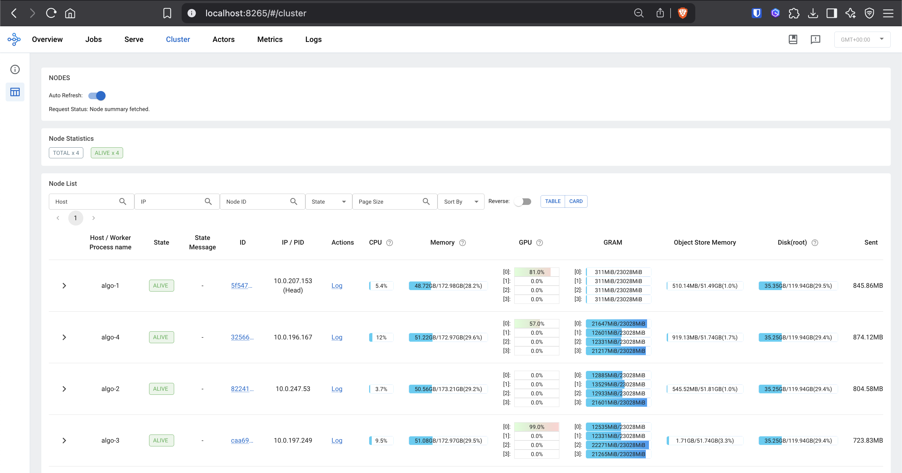
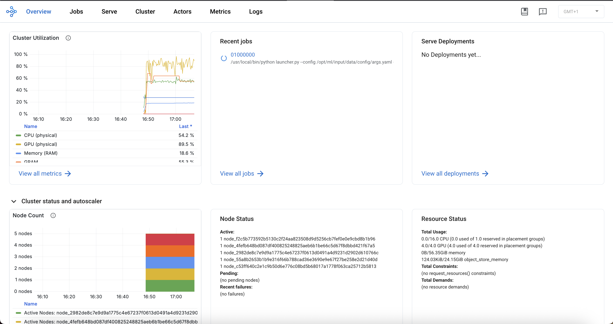

# Ray on Amazon SageMaker training jobs

This repository demonstrates how to use Ray for distributed data processing and model training within Amazon SageMaker training jobs.

## Table of Contents

- [Prerequisites](#prerequisites)
- [Project Structure](#project-structure)
- [Key Components](#key-components)
  - [Launcher](#launcher)
  - [Required Parameters and Environment Variables](#required-parameters-and-environment-variables)
    - [Parameter Reference](#parameter-reference)
    - [Environment Variables Reference](#environment-variables-reference)
  - [Script definition](#script-definition)
- [Examples](#examples)
- [Example Usage](#example-usage)
- [Ray Dashboard](#ray-dashboard)
- [Observability with Prometheus and Grafana](#observability-with-prometheus-and-grafana)
  - [Prometheus and Grafana hosted in an external server](#prometheus-and-grafana-hosted-in-an-external-server)
  - [Local Prometheus on the SageMaker cluster and Grafana running on an external server](#local-prometheus-on-the-sagemaker-cluster-and-grafana-running-on-an-external-server)

## Prerequisites

- AWS account with Amazon SageMaker AI access
- Ray 2.0.0+
- SageMaker Python SDK >=3.5.0

## Project Structure

```
ray-sagemaker-training/
├── scripts/
│    └── launcher.py
├── examples/
│    ├── ray-remote/
│    │    ├── pytorch/                    # Homogeneous cluster
│    │    │    ├── notebook.ipynb
│    │    │    └── scripts/
│    │    │         ├── train.py
│    │    │         ├── model.py
│    │    │         └── requirements.txt
│    │    └── pytorch-heterogeneous/      # Heterogeneous cluster
│    │         ├── notebook.ipynb
│    │         └── scripts/
│    │              ├── train.py
│    │              ├── model.py
│    │              └── requirements.txt
│    ├── ray-data/
│    │    ├── pytorch/
│    │    │    ├── notebook.ipynb
│    │    │    └── scripts/
│    │    │         ├── inference.py
│    │    │         ├── model.py
│    │    │         └── requirements.txt
│    │    └── pytorch-heterogeneous/
│    │         ├── notebook.ipynb
│    │         └── scripts/
│    │              ├── inference.py
│    │              ├── model.py
│    │              └── requirements.txt
│    ├── ray-tune/
│    │    ├── pytorch/
│    │    │    ├── notebook.ipynb
│    │    │    └── scripts/
│    │    │         ├── tune.py
│    │    │         ├── model.py
│    │    │         └── requirements.txt
│    │    └── pytorch-heterogeneous/
│    │         ├── notebook.ipynb
│    │         └── scripts/
│    │              ├── tune.py
│    │              ├── model.py
│    │              └── requirements.txt
│    └── ray-torchtrainer/
│         ├── huggingface/
│         │    ├── notebook.ipynb
│         │    └── scripts/
│         │         ├── train_ray.py
│         │         └── requirements.txt
│         └── huggingface-heterogeneous/
│              ├── notebook.ipynb
│              └── scripts/
│                   ├── train_ray.py
│                   └── requirements.txt
└── images/
```

## Key Components

### Launcher

The `launcher.py` script serves as the entry point for SageMaker training jobs and handles:

- Setting up the Ray environment for both single-node and multi-node scenarios
- Supporting both homogeneous and heterogeneous instance group clusters
- Coordinating between head and worker nodes in a distributed setup
- Configuring EFA/RDMA networking for supported GPU instances
- Optionally launching Prometheus for metrics collection
- Executing the appropriate user script (Python `.py` or Bash `.sh`)
- Graceful shutdown with configurable wait period

#### Important Note

**The `launcher.py` script is not intended to be modified by users.** This script serves as a universal entrypoint for SageMaker training jobs and handles Ray cluster setup, coordination between nodes, and execution of your custom scripts.

You should:

- Write your own Ray scripts for data processing or model training
- Use `launcher.py` as the entrypoint in your SageMaker jobs
- Make sure your `requirements.txt` or your container includes `ray[data,train,tune,serve]` and `sagemaker`
- Specify the custom script path using the `-e` / `--entrypoint` argument

### Required Parameters and Environment Variables

The `launcher.py` script requires specific parameters to execute your custom training scripts. You can configure these through command line arguments or environment variables.

### Parameter Reference

| Argument                | Type   | Required | Default          | Description                                                              |
| ----------------------- | ------ | -------- | ---------------- | ------------------------------------------------------------------------ |
| `-e`, `--entrypoint`    | string | Yes      | None             | Path to your script (e.g., `train.py`, `training/train.py`, `run.sh`)    |
| `--head-instance-group` | string | Yes\*    | None             | Instance group name for Ray head node (heterogeneous clusters only)      |
| `--head-num-cpus`       | int    | No       | Instance default | Number of CPUs reserved for head node                                    |
| `--head-num-gpus`       | int    | No       | Instance default | Number of GPUs reserved for head node                                    |
| `--include-dashboard`   | bool   | No       | True             | Enable Ray dashboard                                                     |
| `--launch-prometheus`   | bool   | No       | False            | Launch local Prometheus on the head node. Internet connectivity required |
| `--prometheus-path`     | string | No       | None             | Path to prometheus binary if provided as InputData                       |
| `--wait-shutdown`       | int    | No       | None             | Seconds to wait before Ray shutdown                                      |

\*Required only for heterogeneous clusters

### Environment Variables Reference

All parameters above can also be set as environment variables via the `environment` dict in your ModelTrainer or Estimator configuration. Environment variables are used as fallback when the corresponding command line argument is not provided.

| Variable              | Type   | Required | Description                                                                                 |
| --------------------- | ------ | -------- | ------------------------------------------------------------------------------------------- |
| `head_instance_group` | string | No       | Alternative way to set head instance group name (heterogeneous clusters only)               |
| `head_num_cpus`       | int    | No       | Alternative way to set number of CPUs reserved for head node                                |
| `head_num_gpus`       | int    | No       | Alternative way to set number of GPUs reserved for head node                                |
| `launch_prometheus`   | bool   | No       | Alternative way to launch local Prometheus on the head node. Internet connectivity required |
| `prometheus_path`     | string | No       | Path to prometheus binary if provided as InputData                                          |
| `wait_shutdown`       | int    | No       | Alternative way to set shutdown wait time                                                   |

### Script definition

The entry script can be a Python (`.py`) or Bash (`.sh`) file.

Python entry scripts must contain a `__main__` block:

```python
import ray

# Your Ray code here

if __name__ == "__main__":
    # This block will be executed by the launcher
    pass
```

Bash entry scripts are executed directly via `bash <script_path>`.

## Examples

The repository includes 8 example notebooks covering 4 Ray patterns, each with both homogeneous and heterogeneous cluster configurations.

Each notebook copies `launcher.py` into its local `scripts/` directory and launches a SageMaker training job using the PySDK v3 `ModelTrainer` API.

| Pattern              | Description                                                                                                                              | Homogeneous         | Heterogeneous                                           |
| -------------------- | ---------------------------------------------------------------------------------------------------------------------------------------- | ------------------- | ------------------------------------------------------- |
| **ray-remote**       | Distributed task-level parallelism using `@ray.remote` for data cleaning and PyTorch model training (sentiment classification)           | 1x `ml.m5.2xlarge`  | 1x `ml.t3.large` (head) + 2x `ml.m5.2xlarge` (workers)  |
| **ray-data**         | Batch inference with `ray.data` using ResNet152 on Imagenette dataset                                                                    | 1x `ml.m5.2xlarge`  | 1x `ml.t3.large` (head) + 2x `ml.m5.2xlarge` (workers)  |
| **ray-tune**         | Hyperparameter tuning with `ray.tune` and ASHA scheduler on CIFAR-10                                                                     | 1x `ml.m5.2xlarge`  | 1x `ml.t3.large` (head) + 2x `ml.m5.2xlarge` (workers)  |
| **ray-torchtrainer** | Distributed LLM fine-tuning (LoRA/QLoRA) with `ray.train.torch.TorchTrainer`, HuggingFace Transformers, and optional MLflow/W&B tracking | 1x `ml.g5.12xlarge` | 1x `ml.t3.2xlarge` (head) + 4x `ml.g5.xlarge` (workers) |

In heterogeneous configurations, the head node is configured as coordinator-only (`head_num_cpus=0`, `head_num_gpus=0`), while the worker instance group handles computation.

## Example Usage

The launcher script has been designed to be flexible and dynamic, allowing you to specify any entry script through arguments or environment variables, rather than hardcoded imports.

### Entrypoint Argument

The launcher uses one argument:

- `-e` / `--entrypoint`: Path to the script to execute (Python files must contain `if __name__ == "__main__":` block)

### Usage Examples

See the content of [examples](./examples)

#### 1. Using SageMaker ModelTrainer (Recommended)

```python
from sagemaker.train.configs import (
    Compute,
    OutputDataConfig,
    SourceCode,
    StoppingCondition,
)
from sagemaker.train.model_trainer import ModelTrainer

args = [
    "-e",
    "train.py",
    "--epochs",
    "25",
    "--learning_rate",
    "0.001",
    "--batch_size",
    "100",
]

# Define the source code configuration
source_code = SourceCode(
    source_dir="./scripts",
    requirements="requirements.txt",
    command=f"python launcher.py {' '.join(args)}",
)

# Define compute configuration
compute_configs = Compute(
    instance_type="ml.m5.2xlarge",
    instance_count=1,
    keep_alive_period_in_seconds=0,
)

# Define training job name and output path
job_name = "train-ray-training"
output_path = f"s3://{bucket_name}/{job_name}"

# Create the ModelTrainer
model_trainer = ModelTrainer(
    training_image=image_uri,
    source_code=source_code,
    base_job_name=job_name,
    compute=compute_configs,
    stopping_condition=StoppingCondition(max_runtime_in_seconds=18000),
    output_data_config=OutputDataConfig(s3_output_path=output_path),
    role=role,
)

...

# Start the training job
model_trainer.train(input_data_config=[train_input], wait=False)
```

#### 2. Heterogeneous Cluster with SageMaker ModelTrainer

```python
from sagemaker.train.configs import (
    Compute,
    InstanceGroup,
    OutputDataConfig,
    RemoteDebugConfig,
    SourceCode,
    StoppingCondition,
)
from sagemaker.train.model_trainer import ModelTrainer

# Define instance groups with different instance types
instance_groups = [
    InstanceGroup(
        instance_group_name="head-instance-group",
        instance_type="ml.t3.large",       # CPU-only for coordination
        instance_count=1,
    ),
    InstanceGroup(
        instance_group_name="worker-instance-group-1",
        instance_type="ml.m5.2xlarge",     # Compute instances for training
        instance_count=2,
    ),
]

args = [
    "--entrypoint",
    "train.py",
    "--epochs",
    "100",
    "--learning_rate",
    "0.001",
    "--batch_size",
    "100",
]

# Define the source code configuration
source_code = SourceCode(
    source_dir="./scripts",
    requirements="requirements.txt",
    command=f"python launcher.py {' '.join(args)}",
)

# Define compute with instance groups
compute_configs = Compute(
    instance_groups=instance_groups,
    keep_alive_period_in_seconds=0,
)

# Define training job name and output path
job_name = "train-ray-training"
output_path = f"s3://{bucket_name}/{job_name}"

# Create the ModelTrainer
model_trainer = ModelTrainer(
    training_image=image_uri,
    source_code=source_code,
    base_job_name=job_name,
    compute=compute_configs,
    stopping_condition=StoppingCondition(max_runtime_in_seconds=18000),
    output_data_config=OutputDataConfig(
        s3_output_path=output_path, compression_type="NONE"
    ),
    environment={
        "head_instance_group": "head-instance-group",  # Specify which group is the head
        "head_num_cpus": "0",   # Head node as coordinator only
        "head_num_gpus": "0",   # Head node as coordinator only
    },
    role=role,
).with_remote_debug_config(RemoteDebugConfig(enable_remote_debug=True))

...

# Start the training job
model_trainer.train(input_data_config=[train_input], wait=False)
```

**Key environment variables for heterogeneous clusters:**

- `head_instance_group`: Specifies which instance group should act as the Ray head node
- `head_num_cpus`: Number of CPUs to reserve for the head node (set to `"0"` for coordinator-only mode)
- `head_num_gpus`: Number of GPUs to reserve for the head node (set to `"0"` for coordinator-only mode)

### Entry Script Requirements

Your entry scripts must follow this pattern:

```python
# my_script.py
import ray

# Your Ray code here

if __name__ == "__main__":
    # This block will be executed by the launcher
    # Ray is already initialized — use ray.cluster_resources(), @ray.remote, etc.
    pass
```

## Ray Dashboard

For accessing the Ray Dashboard during the execution of Ray workload, we can leverage the native feature to access [SageMaker training jobs by using AWS System Manager (SSM)](https://docs.aws.amazon.com/sagemaker/latest/dg/train-remote-debugging.html)

### Step 1: Setup IAM Permissions:

Please refer to the official [AWS Documentation](https://docs.aws.amazon.com/sagemaker/latest/dg/train-remote-debugging.html#train-remote-debugging-iam)

### Step 2:

Enable remote debugging for SageMaker training jobs:

```python
from sagemaker.train.configs import (
    CheckpointConfig,
    Compute,
    OutputDataConfig,
    RemoteDebugConfig,
    SourceCode,
    StoppingCondition,
)
from sagemaker.train.model_trainer import ModelTrainer

# Define the script to be run
source_code = SourceCode(
    source_dir="./scripts",
    requirements="requirements.txt",
    command="python launcher.py --entrypoint train_ray.py",
)

# Define the compute
compute_configs = Compute(
    instance_type=instance_type,
    instance_count=instance_count,
    keep_alive_period_in_seconds=0,
)

...

# Define the ModelTrainer
model_trainer = ModelTrainer(
    training_image=image_uri,
    source_code=source_code,
    base_job_name=job_name,
    compute=compute_configs,
    stopping_condition=StoppingCondition(max_runtime_in_seconds=18000),
    output_data_config=OutputDataConfig(s3_output_path=output_path),
    checkpoint_config=CheckpointConfig(
        s3_uri=output_path + "/checkpoint", local_path="/opt/ml/checkpoints"
    ),
    role=role,
).with_remote_debug_config(RemoteDebugConfig(enable_remote_debug=True))
```

### Step 3:

Access the training container, by starting a Port Forwarding to the port `8265` (Default Ray Dashboard port) with the following command:

```
aws ssm start-session --target sagemaker-training-job:<training-job-name>_algo-<n> \
--region <aws_region> \
--document-name AWS-StartPortForwardingSession \
--parameters '{"portNumber":["8265"],"localPortNumber":["8265"]}'
```

In a multi-node cluster, you can check the head node by investigating the CloudWatch logs:

```
2025-06-25 08:47:18,755 - __main__ - INFO - Found multiple hosts, initializing Ray as a multi-node cluster
2025-06-25 08:47:18,755 - __main__ - INFO - Head node: algo-1, Current host: algo-3
```

### Step 4:

Access the Ray Dashboard from your browser: `localhost:8265`:



## Observability with Prometheus and Grafana

To allow system metrics collection through Prometheus and Grafana on the SageMaker cluster during the execution of the Ray workload, we can leverage the native feature to access [SageMaker training jobs by using AWS System Manager (SSM)](https://docs.aws.amazon.com/sagemaker/latest/dg/train-remote-debugging.html)

### Prometheus and Grafana hosted in an external server

With this approach, both Prometheus and Grafana server should be deployed on an external system.

> **Note:** Internet connectivity on the SageMaker cluster is required

#### Step 1: Setup IAM Permissions:

Please refer to the official [AWS Documentation](https://docs.aws.amazon.com/sagemaker/latest/dg/train-remote-debugging.html#train-remote-debugging-iam)

#### Step 2:

Enable remote debugging for SageMaker training jobs:

```python
from sagemaker.train.configs import (
    CheckpointConfig,
    Compute,
    OutputDataConfig,
    RemoteDebugConfig,
    SourceCode,
    StoppingCondition,
)
from sagemaker.train.model_trainer import ModelTrainer

# Define the script to be run
source_code = SourceCode(
    source_dir="./scripts",
    requirements="requirements.txt",
    command="python launcher.py --entrypoint train_ray.py",
)

# Define the compute
compute_configs = Compute(
    instance_type=instance_type,
    instance_count=instance_count,
    keep_alive_period_in_seconds=0,
)

...

# Define the ModelTrainer
model_trainer = ModelTrainer(
    training_image=image_uri,
    source_code=source_code,
    base_job_name=job_name,
    compute=compute_configs,
    stopping_condition=StoppingCondition(max_runtime_in_seconds=18000),
    environment={
        "RAY_GRAFANA_HOST": "<GRAFANA_HOST>",
        "RAY_PROMETHEUS_HOST": "<PROMETHEUS_HOST>",
        "RAY_PROMETHEUS_NAME": "prometheus",
    },
    output_data_config=OutputDataConfig(s3_output_path=output_path),
    checkpoint_config=CheckpointConfig(
        s3_uri=output_path + "/checkpoint", local_path="/opt/ml/checkpoints"
    ),
    role=role,
).with_remote_debug_config(RemoteDebugConfig(enable_remote_debug=True))
```

#### Step 3 - Port Forwarding to the Prometheus port in the Grafana server environment:

To make sure your Grafana server will collect the captured metrics by Prometheus, we have to access the training container, by starting a Port Forwarding to the port `8080` (Default port where Ray exports metrics) with the following command:

```
aws ssm start-session --target sagemaker-training-job:<training-job-name>_algo-<n> \
--region <aws_region> \
--document-name AWS-StartPortForwardingSession \
--parameters '{"portNumber":["8080"],"localPortNumber":["<YOUR_LOCAL_PORT>"]}'
```

In a multi-node cluster, you can check the head node by investigating the CloudWatch logs:

```
2025-06-25 08:47:18,755 - __main__ - INFO - Found multiple hosts, initializing Ray as a multi-node cluster
2025-06-25 08:47:18,755 - __main__ - INFO - Head node: algo-1, Current host: algo-3
```

#### Step 4 - Configure prometheus.yml to scrape metrics on the local port:

Configure your `prometheus.yml` file to scrape metrics on the local port where you are forwarding the Ray metrics:

```
...
scrape_configs:
  - job_name: 'ray'
    static_configs:
      - targets: ['localhost:<YOUR_LOCAL_PORT>']
    metrics_path: '/metrics'
  ...
```

#### Step 5 - Port Forwarding to the Ray Dashboard port:

Access the training container, by starting a Port Forwarding to the port `8265` (Default Ray Dashboard port) with the following command:

```
aws ssm start-session --target sagemaker-training-job:<training-job-name>_algo-<n> \
--region <aws_region> \
--document-name AWS-StartPortForwardingSession \
--parameters '{"portNumber":["8265"],"localPortNumber":["8265"]}'
```

In a multi-node cluster, you can check the head node by investigating the CloudWatch logs:

```
2025-06-25 08:47:18,755 - __main__ - INFO - Found multiple hosts, initializing Ray as a multi-node cluster
2025-06-25 08:47:18,755 - __main__ - INFO - Head node: algo-1, Current host: algo-3
```

#### Step 6:

Access the Ray Dashboard from your browser: `localhost:8265`:



### Local Prometheus on the SageMaker cluster and Grafana running on an external server

Ray provides the capability to run local prometheus to collect system metrics during the execution of the workload. With this approach, a Grafana server deployed on an external system is required to get access to the metric visualizations.

> **Note:** Internet connectivity on the SageMaker cluster is required

#### Step 1: Setup IAM Permissions:

Please refer to the official [AWS Documentation](https://docs.aws.amazon.com/sagemaker/latest/dg/train-remote-debugging.html#train-remote-debugging-iam)

#### Step 2:

Enable remote debugging for SageMaker training jobs:

```python
from sagemaker.train.configs import (
    CheckpointConfig,
    Compute,
    OutputDataConfig,
    RemoteDebugConfig,
    SourceCode,
    StoppingCondition,
)
from sagemaker.train.model_trainer import ModelTrainer

# Define the script to be run
source_code = SourceCode(
    source_dir="./scripts",
    requirements="requirements.txt",
    command="python launcher.py --entrypoint train_ray.py",
)

# Define the compute
compute_configs = Compute(
    instance_type=instance_type,
    instance_count=instance_count,
    keep_alive_period_in_seconds=0,
)

...

# Define the ModelTrainer
model_trainer = ModelTrainer(
    training_image=image_uri,
    source_code=source_code,
    base_job_name=job_name,
    compute=compute_configs,
    stopping_condition=StoppingCondition(max_runtime_in_seconds=18000),
    environment={
        "launch_prometheus": "true",
        "RAY_GRAFANA_HOST": "<GRAFANA_HOST>",
    },
    output_data_config=OutputDataConfig(s3_output_path=output_path),
    checkpoint_config=CheckpointConfig(
        s3_uri=output_path + "/checkpoint", local_path="/opt/ml/checkpoints"
    ),
    role=role,
).with_remote_debug_config(RemoteDebugConfig(enable_remote_debug=True))
```

#### Step 3 - Port Forwarding to the Prometheus port in the Grafana server environment:

To make sure your Grafana server will collect the captured metrics by Prometheus, we have to access the training container, by starting a Port Forwarding to the port `9090` (Default Prometheus port) with the following command:

```
aws ssm start-session --target sagemaker-training-job:<training-job-name>_algo-<n> \
--region <aws_region> \
--document-name AWS-StartPortForwardingSession \
--parameters '{"portNumber":["9090"],"localPortNumber":["9090"]}'
```

In a multi-node cluster, you can check the head node by investigating the CloudWatch logs:

```
2025-06-25 08:47:18,755 - __main__ - INFO - Found multiple hosts, initializing Ray as a multi-node cluster
2025-06-25 08:47:18,755 - __main__ - INFO - Head node: algo-1, Current host: algo-3
```

#### Step 4 - Port Forwarding to the Ray Dashboard port:

Access the training container, by starting a Port Forwarding to the port `8265` (Default Ray Dashboard port) with the following command:

```
aws ssm start-session --target sagemaker-training-job:<training-job-name>_algo-<n> \
--region <aws_region> \
--document-name AWS-StartPortForwardingSession \
--parameters '{"portNumber":["8265"],"localPortNumber":["8265"]}'
```

In a multi-node cluster, you can check the head node by investigating the CloudWatch logs:

```
2025-06-25 08:47:18,755 - __main__ - INFO - Found multiple hosts, initializing Ray as a multi-node cluster
2025-06-25 08:47:18,755 - __main__ - INFO - Head node: algo-1, Current host: algo-3
```

#### Step 5:

Access the Ray Dashboard from your browser: `localhost:8265`:


##### (Optional) Provide prometheus binary file

By default, Ray downloads the Prometheus binary from the internet when launching Prometheus for metrics collection. In environments with limited internet connectivity or for better control over dependencies, you can pre-download the Prometheus binary, upload it to S3, and provide it as a training parameter.

###### Step 1: Download Prometheus Binary

Download the appropriate Prometheus binary for your target environment (typically Linux AMD64 for SageMaker training instances):

```bash
wget https://github.com/prometheus/prometheus/releases/download/v3.4.2/prometheus-3.4.2.linux-amd64.tar.gz
```

###### Step 2: Upload to S3

Upload the downloaded binary to your S3 bucket:

```python
import boto3
from sagemaker.core.helper.session_helper import Session

sagemaker_session = Session()
s3_client = boto3.client('s3')

bucket_name = sagemaker_session.default_bucket()
default_prefix = sagemaker_session.default_bucket_prefix

# Define S3 path for prometheus binary
if default_prefix:
    input_path = f"{default_prefix}/datasets/your-project-name"
else:
    input_path = f"datasets/your-project-name"

prometheus_s3_path = f"s3://{bucket_name}/{input_path}/prometheus/prometheus-3.4.2.linux-amd64.tar.gz"

# Upload the binary to S3
s3_client.upload_file(
    "./prometheus-3.4.2.linux-amd64.tar.gz",
    bucket_name,
    f"{input_path}/prometheus/prometheus-3.4.2.linux-amd64.tar.gz",
)

print(f"Prometheus binary uploaded to: {prometheus_s3_path}")
```

###### Step 3: Configure Training Input

Add the Prometheus binary as a training input channel:

```python
from sagemaker.train.configs import InputData, S3DataSource

prometheus_input = InputData(
    channel_name="prometheus",
    data_source=S3DataSource(
        s3_data_type="S3Prefix",
        s3_uri=prometheus_s3_path,
        s3_data_distribution_type="FullyReplicated",
    ),
)

# Add to your training data inputs
data = [
    train_input,
    config_input,
    prometheus_input,
]
```

###### Step 4: Configure the launcher to use the provided binary

Pass the `--prometheus-path` argument pointing to where SageMaker mounts the input channel:

```python
args = [
    "--entrypoint",
    "train_ray.py",
    "--prometheus-path",
    "/opt/ml/input/data/prometheus/prometheus-3.4.2.linux-amd64.tar.gz",
]

source_code = SourceCode(
    source_dir="./scripts",
    requirements="requirements.txt",
    command=f"python launcher.py {' '.join(args)}",
)

model_trainer = ModelTrainer(
    ...
    source_code=source_code,
    environment={
        "launch_prometheus": "true",
        "RAY_GRAFANA_HOST": "<GRAFANA_HOST>",
    },
    ...
)
```

## Authors

[Bruno Pistone](https://it.linkedin.com/in/bpistone) - Sr. WW Gen AI/ML Specialist Solutions Architect - Amazon SageMaker AI

[Giuseppe A. Porcelli](https://it.linkedin.com/in/giuporcelli) - Principal, ML Specialist Solutions Architect - Amazon SageMaker AI


